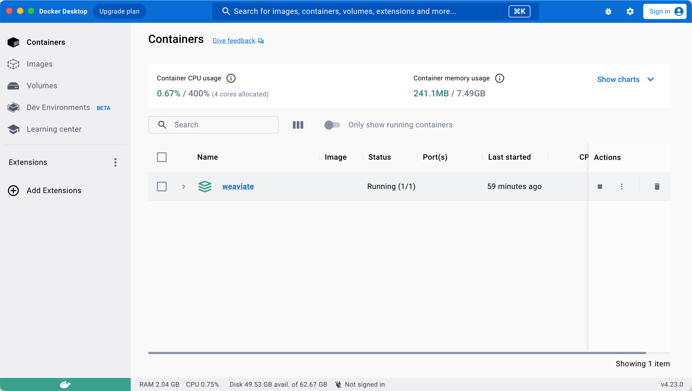

# Weaviate

This project use Weaviate as the vector database.

## Installation with docker
Download a docker client from [here](https://www.docker.com/products/docker-desktop). Install & run.

Use the following code to start Weaviate. If you're using IntelliJ, click the run button on the left side of the code will do it. 
```bash
docker compose up -d
```

However, if you want to run it in the terminal, make sure you're in this directory, as the command would only run the **docker-compose.yml** file in the working directory.

## Work with the database

You will need to upload embeddings to the database everytime you start a new instance.

Note: The database will remain the same even if you restart the docker container. However, if you delete the container and volume, the database will be deleted as well.

Therefore, it's hightly recommended to have a good naming convention for the collection for different dataset. For example "name_of_the_dataset-name_of_the_agent". This way, you can keep all the embeddings while not mass up with your database.

## Brief introduction to Docker
See the screenshot below. 

After you run the docker compose command, docker will build image in the image tab. The image is stored on your disk, and you don't need to rebuild image everytime. So leave it there, and don't delete it.

The Weaviate instance is runnint in a container, the green icon as shown in the image. If you want to delete your database instance, delete this one. Again note: delete the container will totally remove all data insdie.


## Weaviate documentation
https://weaviate.io/developers/weaviate/api/graphql
